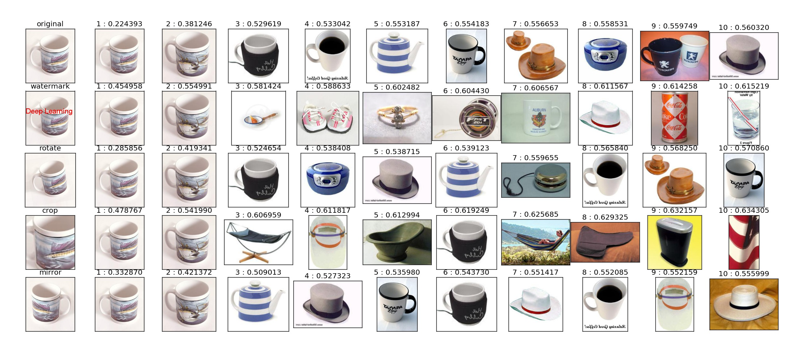

[中文](https://github.com/GYXie/visual-search/blob/master/README.CN.md)
# A toy project for visual search, based on deep learning
This article describes how to quickly build an image retrieval tool based on deep learning.
## Data
- Dataset: [Caltech256](http://www.vision.caltech.edu/Image_Datasets/Caltech256/) Contains 30, 607 images from Google Image Search and PicSearch.com. These images were assigned to 257 categories by manual discrimination. In this experiment we use Caltech256 as the image library we want to retrieve. [Dowload](http://www.vision.caltech.edu/Image_Datasets/Caltech256/256_ObjectCategories.tar)
- Code: Michael Guerzhoy, a researcher at the University of Toronto, provides AlexNet's TensorFlow implementation and weights on his personal website(http://www.cs.toronto.edu/~guerzhoy/tf_alexnet/). It's not easy to build a machine that can train a deep learning model, let alone how long it takes to train a good model. With this well-trained model, everyone can quickly experience the charm of deep learning.

[Download model weights(bvlc_alexnet.npy)](http://www.cs.toronto.edu/~guerzhoy/tf_alexnet/bvlc_alexnet.npy)

## Tools
- Install Python and related lib(TensorFlow etc.), It is recommended to install [Anaconda](https://www.continuum.io/downloads).

## Preporcessing
1. Resize
The size of the input image of the trained AlexNet model is fixed [227, 227], while the width and height of the picture in Caltech256 are not fixed. `image_resize.py` can batch resize the images under a certain directory and save them to another directory. Tap `python ./visual_search/tools/image_resize.py -h` in the terminal to view the instructions.

```
usage: image_resize.py [-h] [--input_data_dir INPUT_DATA_DIR]
                       [--output_data_dir OUTPUT_DATA_DIR] [--width WIDTH]
                       [--height HEIGHT]

optional arguments:
  -h, --help            show this help message and exit
  --input_data_dir INPUT_DATA_DIR
                        Directory to put the input data.
  --output_data_dir OUTPUT_DATA_DIR
                        Directory to put the output data.
  --width WIDTH         Target image width.
  --height HEIGHT       Target image height.
```

2. Extract image features
Use `visual_search/myalexnet_feature.py` to extract the feature of each image in the library. This script will output two files: the feature of every image, and the full path of all images.

```
$ cd visual_search
$ python myalexnet_feature.py -h
usage: myalexnet_feature.py [-h] [--input_data_dir INPUT_DATA_DIR]
                            [--output_feature_file OUTPUT_FEATURE_FILE]
                            [--output_image_name_file OUTPUT_IMAGE_NAME_FILE]

optional arguments:
  -h, --help            show this help message and exit
  --input_data_dir INPUT_DATA_DIR
                        Directory to put the input data.
  --output_feature_file OUTPUT_FEATURE_FILE
                        Output features path.
  --output_image_name_file OUTPUT_IMAGE_NAME_FILE
                        Output image names path.
```


## Play
In the `visual_search/visual_search.py` script, you can modify the path of the image feature and the path of the image name for retrieval. The input image can be a local image or a picture url.

```
usage: visual_search.py [-h] [--img_file_path IMG_FILE_PATH]
                        [--img_url IMG_URL]

optional arguments:
  -h, --help            show this help message and exit
  --img_file_path IMG_FILE_PATH
                        Image file path.
  --img_url IMG_URL     Image Url.

```



You will find several lines of images. Each line is a search record. The input image is the first one of each line. The input images of lines 2 to 5 are obtained by watermarking, rotating, cropping, and mirroring the original image.

In fact, this experimental project took less than a week of spare time. According to the information I provided, I believe you can make your own image search tool based on deep learning in a short period of time.

Github: [https://github.com/GYXie/visual-search](https://github.com/GYXie/visual-search)

中文博客: [炒一锅基于深度学习的图像检索工具](http://gyxie.github.io/2017/02/26/%E7%82%92%E4%B8%80%E9%94%85%E5%9F%BA%E4%BA%8E%E6%B7%B1%E5%BA%A6%E5%AD%A6%E4%B9%A0%E7%9A%84%E5%9B%BE%E5%83%8F%E6%A3%80%E7%B4%A2%E5%B7%A5%E5%85%B7/)

## Reference
- Jing Y, Liu D, Kislyuk D, et al. Visual search at pinterest[C]//Proceedings of the 21th ACM SIGKDD International Conference on Knowledge Discovery and Data Mining. ACM, 2015: 1889-1898.
